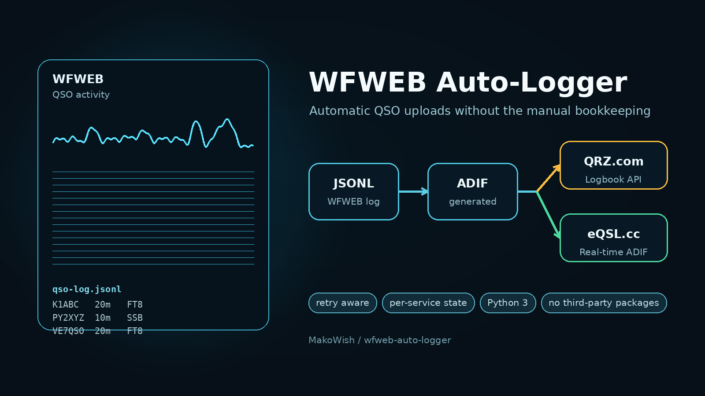

# WFWEB Auto-Logger



`wfweb-auto-logger` watches WFWEB's JSON-lines QSO log and automatically uploads each new contact to every enabled online logbook. QRZ.com and eQSL.cc are currently supported.

## Requirements

- Python 3 (no third-party packages are required)
- A WFWEB QSO log (pending [adecarolis/wfweb/issues/109](https://github.com/adecarolis/wfweb/issues/109))
- Credentials/API Keys for each logbook you enable

## Usage

At least one destination and the station callsign must be configured. Multiple `--enable-*` options may be supplied; each QSO is sent to all enabled destinations.

```console
./wfweb-auto-logger \
  --station-callsign KF0ZJT \
  --enable-qrz --qrz-api-key 'your-qrz-key' \
  --enable-eqsl --eqsl-username 'KF0ZJT' --eqsl-password 'your-eqsl-password'
```

Credentials can instead be supplied through environment variables, which keeps secrets out of the process list:

```console
export STATION_CALLSIGN='KF0ZJT'
export QRZ_API_KEY='your-qrz-key'
export EQSL_USERNAME='KF0ZJT'
export EQSL_PASSWORD='your-eqsl-password'
./wfweb-auto-logger --enable-qrz --enable-eqsl
```

### QRZ.com

Enable QRZ with `--enable-qrz`. Supply its Logbook API key with `--qrz-api-key` or `QRZ_API_KEY`.

### eQSL.cc

Enable eQSL with `--enable-eqsl`. Unlike QRZ, eQSL's ADIF upload interface authenticates with the account username and password rather than an API key:

- `--eqsl-username` or `EQSL_USERNAME`
- `--eqsl-password` or `EQSL_PASSWORD`
- Optional: `--eqsl-qth-nickname` or `EQSL_QTH_NICKNAME` to select an eQSL station profile

If the password contains shell metacharacters, quote it when passing it on the command line. Environment variables are preferable.

The logger encodes these credentials as the `eQSL_User` and `eQSL_Pswd`
fields required by eQSL's real-time ADIF interface. If eQSL reports
`Missing eQSL_User`, verify that the installed logger contains eQSL support and
that `--eqsl-username` (or `EQSL_USERNAME`) is set.

## Options

| Option | Environment variable | Description |
| --- | --- | --- |
| `--station-callsign CALL` | `STATION_CALLSIGN` | Callsign written to `STATION_CALLSIGN` in uploaded ADIF |
| `--enable-qrz` | — | Upload to QRZ.com |
| `--qrz-api-key KEY` | `QRZ_API_KEY` | QRZ Logbook API key |
| `--enable-eqsl` | — | Upload to eQSL.cc |
| `--eqsl-username NAME` | `EQSL_USERNAME` | eQSL account username/callsign |
| `--eqsl-password PASSWORD` | `EQSL_PASSWORD` | eQSL account password |
| `--eqsl-qth-nickname NAME` | `EQSL_QTH_NICKNAME` | Optional eQSL QTH nickname |
| `--log-file PATH` | — | WFWEB JSONL log path |
| `--state-file PATH` | — | Upload progress state path |
| `--failed-file PATH` | — | Rejected or invalid record output path |
| `--from-start` | — | Upload existing records on the first run instead of starting at EOF |
| `--dry-run` | — | Print records and ADIF without uploading or updating state |
| `-v`, `--verbose` | — | Print ADIF and service responses |

Run `./wfweb-auto-logger --help` for the current defaults.

## Delivery, retries, and failures

Progress is tracked independently for each enabled service in the state file. A successful QRZ upload is therefore not repeated merely because the same eQSL upload encountered a temporary network error. Services with transient network errors retry after 30 seconds while successful services continue from their own saved position.

A response-level rejection (for example, invalid credentials or an unacceptable QSO) is recorded in the failed-record JSONL file with a `logger` field identifying the service. It is treated as handled so one bad record cannot permanently block later contacts. Use `--verbose` when diagnosing a rejection.

The default paths are:

```text
Log:     /var/lib/wfweb/.local/share/wfweb/wfweb/qso-log.jsonl
State:   /var/lib/wfweb/.local/share/wfweb/wfweb/qrz-logger.state
Failures:/var/lib/wfweb/.local/share/wfweb/wfweb/qrz-logger-failed.jsonl
```

The original QRZ-only state format is recognized. Its QRZ offset is migrated automatically; a newly enabled service starts at the end of the current log unless `--from-start` is supplied.

## Dry run

A dry run is a safe way to inspect generated ADIF:

```console
./wfweb-auto-logger --enable-qrz --qrz-api-key unused \
  --station-callsign KF0ZJT --dry-run --from-start --verbose
```

Dry runs never contact a service and never update the state or failure files.
